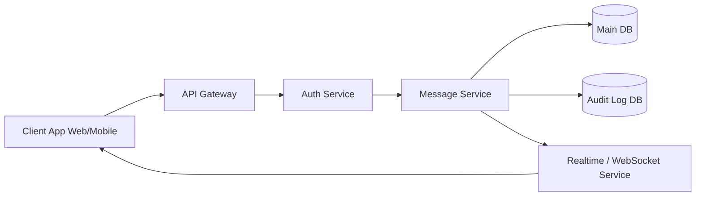
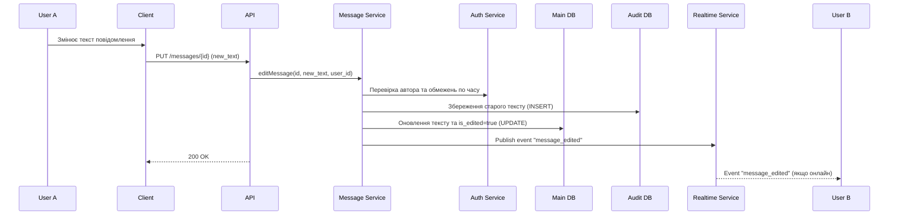
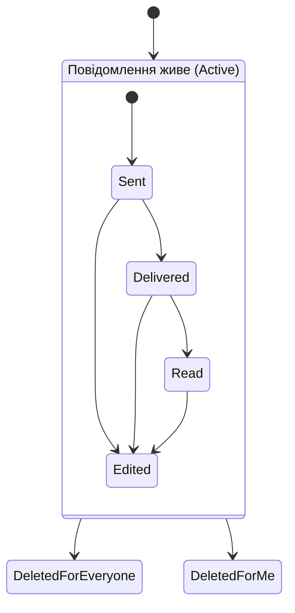

# Laboratory Work 1
## Designing a Messaging System

### Variant 6 — Message Editing & Deletion

#### Part 1 — Component Diagram



### Part 2 — Sequence Diagram



### Part 3 — State Diagram



### Part 4 — ADR (Architecture Decision Record)

ADR-001: Стратегія збереження відредагованих повідомлень (Mutable State + Audit Log)
```markdown
## Status
Accepted

## Context
Користувачам потрібно мати можливість редагувати надіслані повідомлення. Однак, з міркувань безпеки та модерації, система повинна зберігати оригінальний текст повідомлення (Audit trail). Клієнтські додатки потребують швидкого завантаження історії чату без складних обчислень.

## Decision
Для таблиці `Messages` використовувати мутабельний підхід: при редагуванні запис оновлюється новим текстом (UPDATE) і встановлюється прапорець `is_edited = true`. Старі версії повідомлень зберігаються у вигляді незмінних записів (append-only) у додатковій таблиці `Message_Audit_Log`.

## Alternatives
- **Event Sourcing (Тільки Immutable)**: Усі повідомлення та їх зміни зберігаються як події. Клієнт або бекенд мають "склеювати" фінальний стан. (Відхилено: занадто складно для читання великих історій чату, падає продуктивність).
- **Soft-delete і створення нового ID**: При редагуванні старе повідомлення позначається видаленим, і створюється нове з новим ID. (Відхилено: ламає ланцюжки відповідей - "replies", які посилаються на оригінальний ID).

## Consequences
+ **Швидкість читання**: Клієнти швидко отримують актуальний стан чату з однієї таблиці без додаткових JOIN-ів.
+ **Можливість аудиту**: Повна історія змін безпечно зберігається для потреб підтримки/модерації.
- **Складність запису**: Кожне редагування вимагає двох операцій запису у базу даних у рамках однієї транзакції (оновлення `Messages` + вставка в `Message_Audit_Log`).
```
