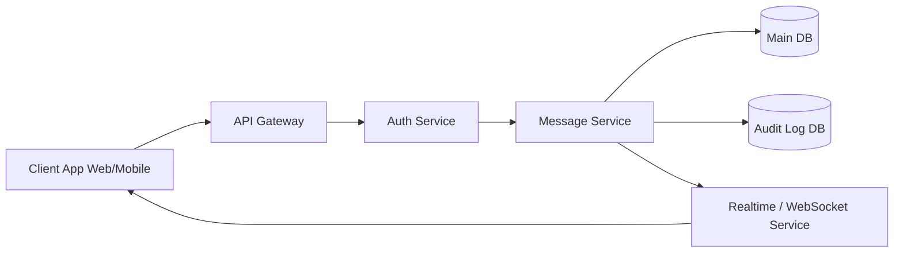
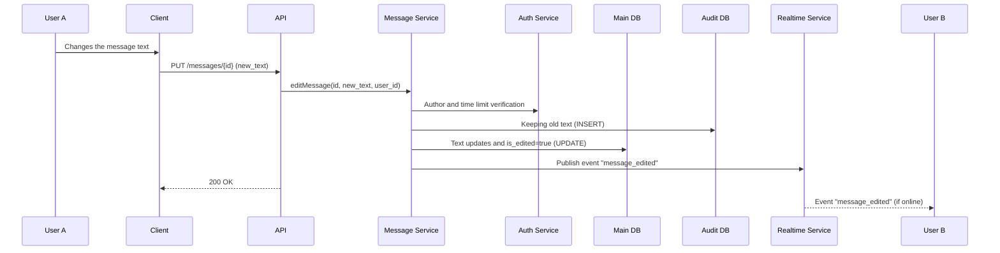
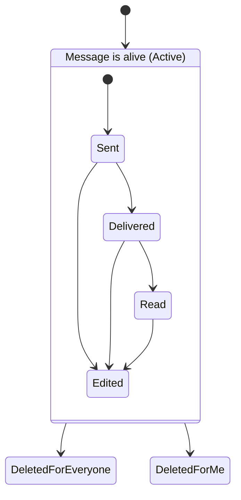

# Laboratory Work 1
## Designing a Messaging System

### Variant 6 — Message Editing & Deletion

#### Part 1 — Component Diagram



### Part 2 — Sequence Diagram



### Part 3 — State Diagram



### Part 4 — ADR (Architecture Decision Record)

```markdown
# ADR-001: Strategy for saving edited messages (Mutable State + Audit Log)

## Status
Accepted

## Context
Users should be able to edit sent messages. However, for security and moderation reasons, the system should retain the original message text. (Audit trail). 
Client applications need to load message history quickly without complex calculations.

## Decision
For the `Messages` table, use a mutable approach: when editing, the record is updated with new text (UPDATE) and the `is_edited = true` flag is set. Old versions of messages are stored as immutable records (append-only) in the additional `Message_Audit_Log` table.

## Alternatives
- **Event Sourcing (Immutable only)**: All messages and their changes are stored as events. The client or backend must "glue" the final state. (Deprecated: too difficult to read large chat histories, performance drops).
- **Soft-delete and create new ID**: When editing, the old message is marked as deleted, and a new one is created with the new ID. (Deprecated: breaks the threads of replies that refer to the original ID).

## Consequences
+ **Read Speed**: Clients quickly get the current chat state from a single table without additional JOINs.
+ **Auditability**: Full change history is securely stored for support/moderation purposes.
- **Write Complexity**: Each edit requires two database writes within a single transaction (update `Messages` + insert into `Message_Audit_Log`).
```
